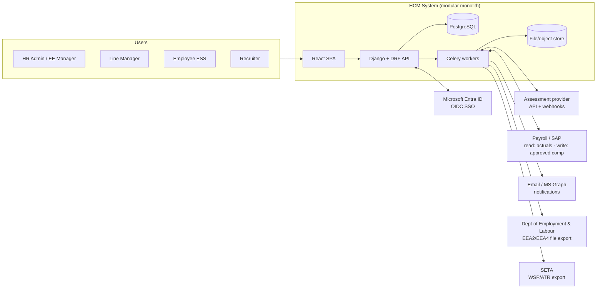
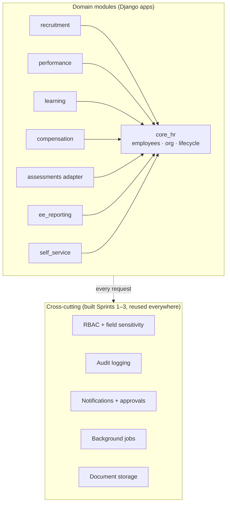
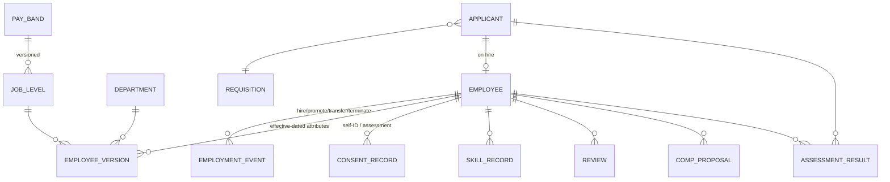

# HCM System — Technical Architecture Design

**Date:** 2026-08-12
**Status:** Proposed (resolves the "Architecture baseline" placeholder in `Sprint-Plan-HCM-System.md`)
**Companion:** `Documentation-Review-and-Gap-Analysis.md` (gap IDs referenced below, e.g. C1, I1)

---

## 1. Context & constraints

The sprint plan fixes these as baseline (kept here, not re-litigated):

- **Modular monolith** — one deployable backend, one PostgreSQL database.
- **React frontend.**
- **One `employees` table as source of truth**; every module FKs back to it.
- **One shared RBAC + audit layer** used by every module.

This document fills in what the baseline left open: framework, auth, history pattern, deployment, integration boundaries, and the cross-cutting services (notifications, jobs, files) that the module sprints silently assume.

## 2. Architecture decision records (summary)

| ADR | Decision | Choice | Rationale |
|---|---|---|---|
| ADR-001 | Backend framework | **Django 5.2 LTS + Django REST Framework** | Batteries-included admin (free HR-admin fallback UI), first-class migrations, mature ecosystem for exactly this system's hard parts: `django-simple-history` (audit/versioning), object/field-level permission libraries, Celery for background jobs. Python also keeps the door open for the optional AI summarization in Sprint 12. Laravel is comparable but the team's other projects here are Python/JS-leaning; Node would mean hand-rolling admin, migrations discipline, and audit tooling |
| ADR-002 | History/versioning | **Effective-dated rows** for org-truth entities (`employees`, assignments, pay bands) **plus** `django-simple-history` change-tracking on everything | Effective-dating answers "what was true on date X" (EE as-at reporting); simple-history answers "who changed what, when" (audit). They solve different problems; both are needed. See §5 |
| ADR-003 | Assessments | **Integrate a 3rd-party provider** behind an adapter interface | Confirms the sprint plan's default; never build psychometrics in-house without specialist input |
| ADR-004 | Authentication | **OIDC single sign-on against Microsoft Entra ID** | Sentech is an M365 estate. No local passwords for staff; local break-glass admin only. Entra groups can seed RBAC role assignment |
| ADR-005 | Hosting | **Docker Compose on a company VM (or Azure equivalent), single node, dev/staging/prod** | Headcount-scale workload (thousands of employees, tens of concurrent users) needs no orchestration platform. Postgres + app + worker + reverse proxy on one host, with tested backups, is the right size. Revisit only if NFRs change |
| ADR-006 | Pay-data authority | **Payroll/SAP remains master for actual pay; HCM masters pay *bands* and comp *proposals*** | Avoids dual-mastering salary. Approved comp reviews export to payroll via the integration layer (I1); actuals sync back read-only. Confirm direction in Sprint 0 |

## 3. System context

External parties are all **file-export or adapter-mediated** — the monolith has no synchronous runtime dependency on any of them except Entra ID at login.

## 4. Application architecture (inside the monolith)

Rules that keep the monolith modular:

- Each module is a **Django app** with its own models, API viewsets, and tests. Apps may import `core_hr` and the cross-cutting layer; they may **not** import each other (e.g., `ee_reporting` reads recruitment data via a defined query interface in `recruitment/queries.py`, not by reaching into its models ad hoc).
- **All API access goes through the shared permission classes** — a DRF permission + a field-sensitivity serializer mixin. No module defines its own access-control mechanism (sprint-plan hard constraint).
- Anything slow (bulk import, report generation, provider webhooks, exports) runs in **Celery workers**, never in the request cycle.
- The **notification/approval primitives** (gap F9) live in the cross-cutting layer: a generic `ApprovalChain` (ordered steps, per-step role, sign-off record) and an outbound notification service. Comp reviews, EE report sign-off, and review cycles all configure these rather than building their own.

## 5. Data architecture

### 5.1 Core model (simplified)

- `EMPLOYEE` holds immutable identity (employee number, national ID reference, hire date). Everything time-varying — department, job level, pay grade, employment status, demographics — lives in **`EMPLOYEE_VERSION` rows with `valid_from`/`valid_to`**. "As-at" queries filter `valid_from <= :date < valid_to`.
- `EMPLOYMENT_EVENT` (gap F1) records lifecycle transitions — hire, promotion, transfer, termination with reason codes — which is precisely the EEA2 workforce-movement dataset.
- **EE reporting reads from frozen snapshots**: generating an EEA2/EEA4 draft materialises an immutable snapshot table stamped with the as-at date; the approval workflow and archive attach to the snapshot, so a later data fix never silently changes a signed report.

### 5.2 Field sensitivity classification

Every column in the data dictionary (Sprint 0) gets one of four tiers; the serializer mixin enforces them:

| Tier | Examples | Who sees it |
|---|---|---|
| Public | name, department, job title | Any authenticated user |
| Internal | employment dates, manager, skills | Manager chain + HR |
| Sensitive | race, gender, disability, performance rating, assessment results | Named roles only (EE manager, HR admin); **aggregate-only** for line managers |
| Restricted | pay, comp proposals, ID number | Comp manager / HR admin; never in aggregates below suppression threshold |

**Small-cell suppression (gap C6):** every aggregate endpoint suppresses cells with `n < 5` (configurable), so dashboards can't be used to re-identify individuals.

### 5.3 POPIA mapping (gap C1)

- **Lawful basis register**: demographics processed for EE reporting = legal obligation (EEA); self-ID beyond that + assessments = consent (`CONSENT_RECORD` with purpose, timestamp, withdrawal).
- **Data-subject rights**: profile view/correction via ESS; a subject-access-report export per employee; deletion = anonymisation of applicant records after a configured retention period (unsuccessful applicants ~12 months), employee records retained per statutory schedules.
- **Retention schedule** is data-dictionary metadata per entity, executed by a scheduled Celery job, logged in the audit trail.

## 6. API design

- REST under `/api/v1/`; DRF viewsets, cursor pagination, RFC 7807-style error envelope.
- **The frontend derives UI visibility from the API, never the reverse**: `GET /api/v1/me/permissions` returns the caller's roles + field-tier grants; serializers already omit unauthorized fields, so a compromised client can't over-fetch.
- Webhook endpoints (assessment provider) are versioned separately, HMAC-signature-verified with replay protection (gap I4).

## 7. RBAC & audit layer (Sprint 2, concretised)

- **Roles** (from the sprint plan's list) are DB rows, not code constants; a role bundles model-level permissions + field-tier grants + a row-scope rule (`all`, `own_team` via the reporting line, `self`).
- Entra ID group claims map to roles at login; HR admin can also assign roles in-app (audited).
- **Audit log**: append-only table (INSERT-only DB grant for the app role) capturing actor, action, entity, field tier touched, timestamp, and request ID. Reads of Sensitive/Restricted fields are logged, not just writes — the sprint plan's acceptance criterion. Retention ≥ 5 years to satisfy PFMA/AGSA expectations (gap C5); partitioned by month so it stays queryable.

## 8. Security controls

- TLS everywhere; Postgres encryption at rest (LUKS or managed-disk encryption); secrets in environment via Docker secrets — never in the repo.
- No local credentials for staff (ADR-004); break-glass admin account stored offline.
- Bulk exports of Sensitive/Restricted data are themselves audited events and watermark the requesting user.
- Dependency scanning + the RBAC regression suite in CI (extends the Sprint 2 baseline every sprint, per the gap-analysis amendment).
- Pre-go-live: the Sprint 16–17 "penetration-style" RBAC testing, plus an infrastructure scan.

## 9. Proposed NFR targets (gap D4 — to be confirmed in Sprint 0)

| NFR | Target |
|---|---|
| Workforce size | ≤ 5 000 employee records (Sentech ~600 staff; headroom for applicants) |
| Concurrent users | 50 typical / 300 peak (review-cycle launch, ESS campaigns) |
| API response | p95 < 500 ms for interactive endpoints; reports/exports async via jobs |
| Availability | 99.5 % business hours; maintenance windows allowed after hours |
| RPO / RTO | ≤ 24 h / ≤ 8 h (nightly backups + restore rehearsal) |
| Browser support | Current Edge/Chrome; responsive layout for ESS on mobile browsers (no native app) |

## 10. Deployment & operations (ADR-005)

- **Topology per environment**: `nginx → Django (gunicorn) → PostgreSQL`, plus `celery worker + beat` and `redis` (broker/cache), all Docker Compose on one host. Object storage = mounted volume (or Azure Blob if hosted there) for imports, generated reports, and documents (gap T6/F8).
- **Environments**: dev → staging → prod; CI (GitHub Actions, matching this repo's `.github/` setup) runs tests + RBAC regression on every PR, builds images, deploys to staging on merge; prod deploys are manual-approval.
- **Backups**: nightly `pg_dump` + object-store sync to a second location; quarterly restore rehearsal (this is the DR plan at this scale).
- **Observability**: structured JSON logs shipped to the company log platform; Sentry (or self-hosted GlitchTip) for error tracking; a `/healthz` endpoint for uptime monitoring.

## 11. Integration layer

| Integration | Pattern | Notes |
|---|---|---|
| Assessment provider | Adapter interface (`assign`, `status`, `result`) + inbound signed webhook; provider-specific adapter behind it | Sprint 12 acceptance criterion "swap by reconfiguration" holds only if module code never imports a concrete adapter |
| Payroll / SAP (ADR-006) | Outbound: approved comp changes as a batch file/IDoc-style export per pay cycle. Inbound: read-only actuals sync | Interface contract drafted in Sprint 0 with the SAP team; build in proposed Sprint 12b |
| Email / notifications | Microsoft Graph sendMail (falls back to SMTP relay) via the cross-cutting notification service | Gap I2/F9 |
| DEL (EEA2/EEA4) | File export per official spec; **field layout is versioned configuration** so annual DEL changes are config edits, not code (gap C3) | |
| SETA (WSP/ATR) | Export from L&D training records (gap C2) | |

## 12. What this changes in the sprint plan

The architecture is compatible with the existing sprint sequence. It adds concrete content to Sprint 0 (ADR sign-offs, interface contract with SAP team, NFR confirmation) and supports the amendments in `Documentation-Review-and-Gap-Analysis.md` §4 — notably lifecycle events in Sprint 1, notification/approval primitives in Sprint 3, the early self-ID mini-sprint, and Sprint 12b for the payroll interface. Any deviation from ADR-001…006 goes back to a human as a new ADR, per the sprint plan's standing rule.
