# Sentech HCM — HR User Guide

**A plain-language guide to the day-to-day tasks in Sentech HCM.** Every section shows a real screenshot of
the actual screen, tells you exactly what to click, and explains what you're looking at. If you've never
used the system before, start at the top and work down — you don't need to read it all at once.

> **Getting stuck?** Every screen has the same shape: a menu down the left, the page title top-left, and
> your name / sign-out link bottom-left. If something looks different from a screenshot here, you may be
> looking at a different role's view — ask your system administrator which role your login has.

---

## Contents

1. [Signing in](#1-signing-in)
2. [Finding and viewing an employee](#2-finding-and-viewing-an-employee)
3. [Understanding your organisation](#3-understanding-your-organisation)
4. [Hiring someone new](#4-hiring-someone-new)
5. [Onboarding a new hire](#5-onboarding-a-new-hire)
6. [Managing probation](#6-managing-probation)
7. [When someone leaves](#7-when-someone-leaves)
8. [Contract renewals](#8-contract-renewals)
9. [Performance periods](#9-performance-periods)
10. [Policies](#10-policies)

---

## 1. Signing in

Open the system in your browser and you'll see the sign-in screen. Type your **username** and **password**
and click **Sign in**.

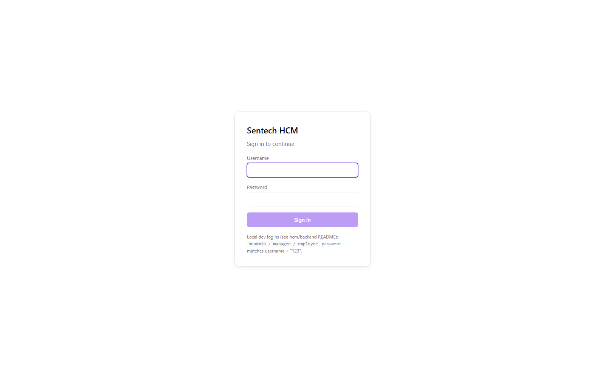

**What this means:** your username and password were given to you by your system administrator. If you've
forgotten your password, you can't reset it yourself yet — ask your administrator to set you a new one (see
`super_smart_admin.md`, "Resetting a password").

Once you're signed in, you'll stay signed in until you click **Sign out** (bottom-left) or your session
expires from inactivity.

---

## 2. Finding and viewing an employee

Click **Employees** in the left-hand menu (under **WORKFORCE**). This is your starting point for almost
everything — every employee's full record lives here.

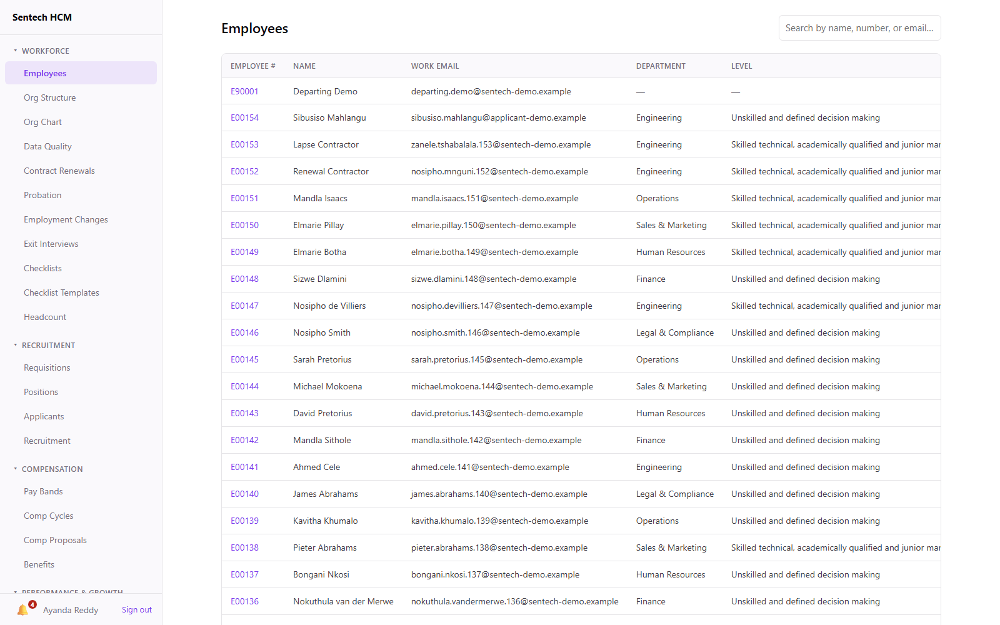

**What you're looking at:**
- The **menu on the left** is organised into groups — Workforce, Recruitment, Compensation, and so on. What
  you see here depends on your role; not everyone sees every item.
- The **table** lists every employee you have permission to see, with their employee number, name, work
  email, department and level.
- Your name and a **Sign out** link are always in the bottom-left corner.

### Searching for someone

Type into the search box, top-right — by name, employee number, or email. The list filters as you type.

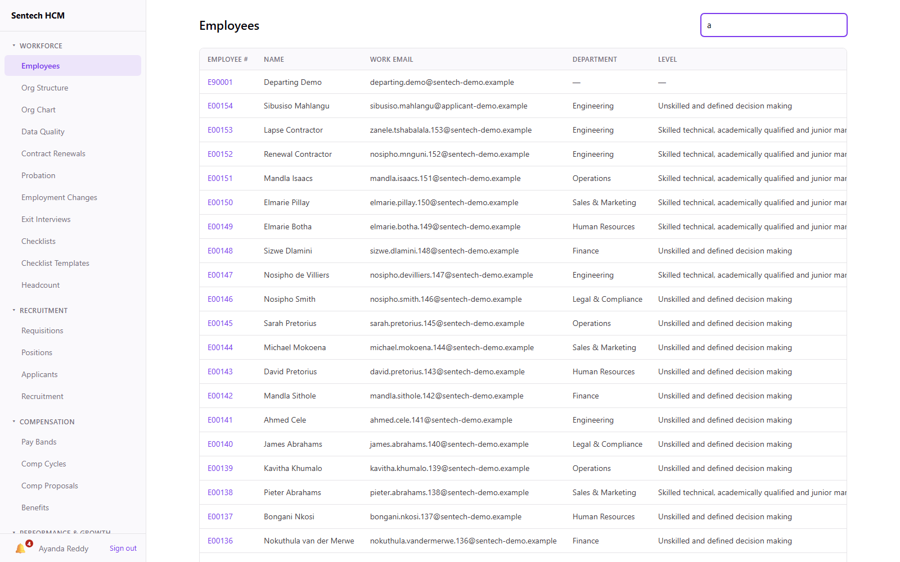

### Opening an employee's record

Click any employee's name (or employee number) to open their full record.

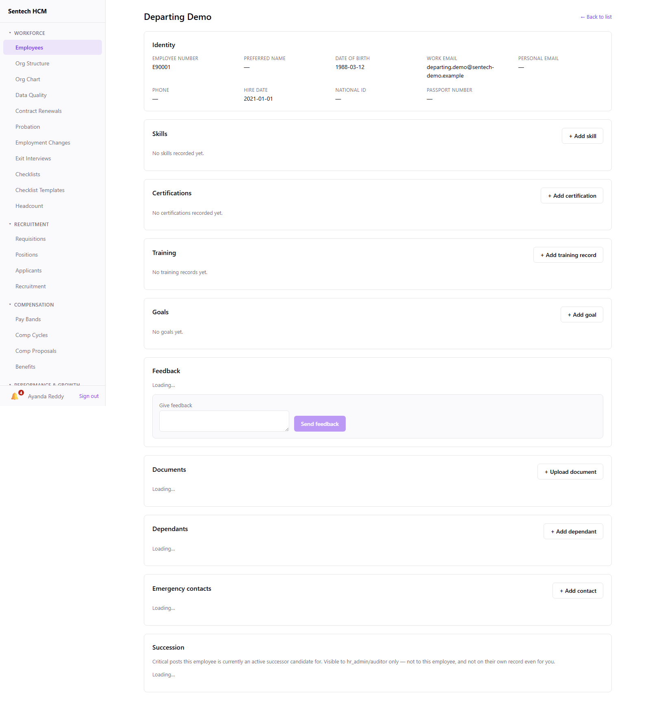

**What you're looking at:** the top card is their core identity — employee number, contact details, hire
date. Below that, separate cards for **Skills**, **Certifications**, **Training**, **Goals**, **Documents**,
**Dependants**, **Emergency contacts**, and (if you're HR admin or an auditor) **Succession** — whether this
person is lined up as a successor for a critical post. Each card has its own **+ Add...** button — you add
things one card at a time, not through one big edit form.

---

## 3. Understanding your organisation

Two related but different views live under **WORKFORCE**: **Org Structure** and **Org Chart**.

### Org Structure — the building blocks

Click **Org Structure**. This is where departments, job grades, locations and occupational levels are
defined — the drop-down options you'll see everywhere else in the system (e.g. when creating a requisition)
come from here.

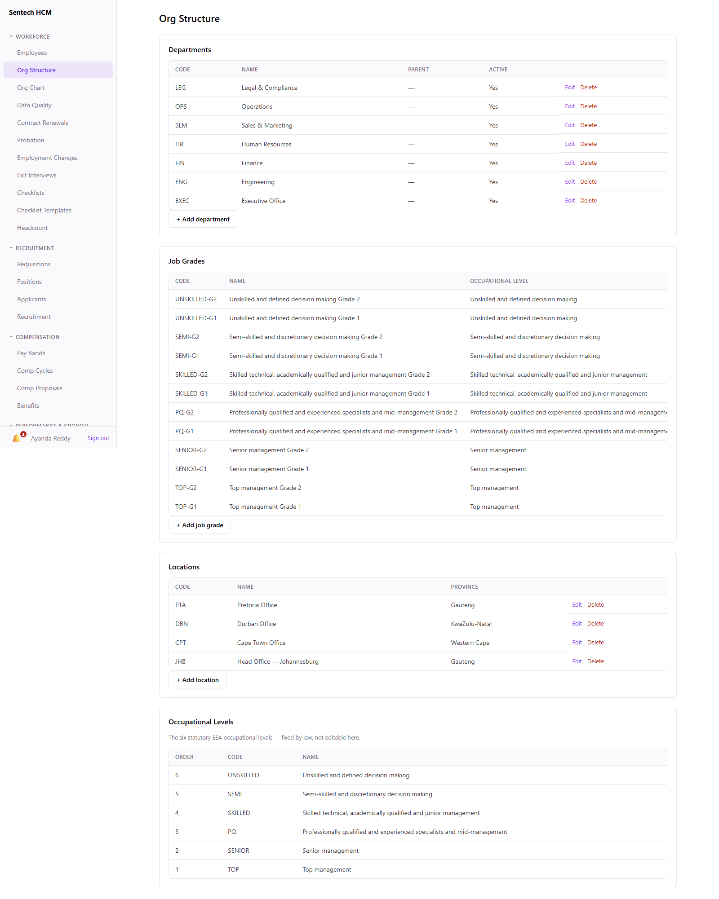

**What this means:** you don't need to visit this page often — mostly when a new department opens, a new
office location is added, or a new job grade is created. **Occupational Levels are fixed by law** (the six
statutory Employment Equity levels) and can't be edited here.

### Org Chart — who reports to whom

Click **Org Chart** to see the actual reporting structure — a collapsible tree starting from the top of the
organisation.

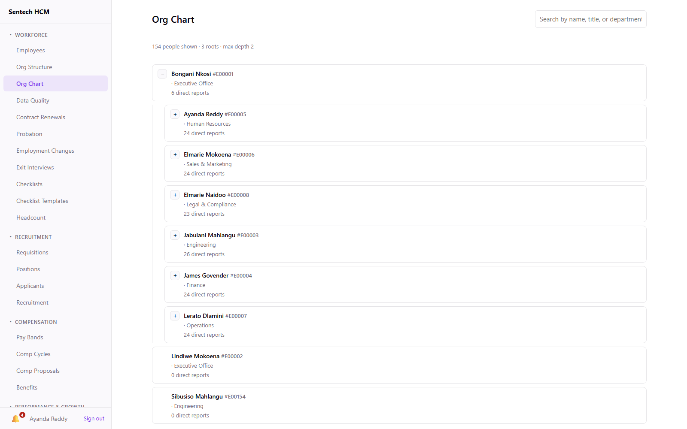

**What this means:** click the **+** next to a name to expand their team; click **−** to collapse it. Use
the search box, top-right, to jump straight to a specific person, department, or job title — the tree
expands automatically to show them.

---

## 4. Hiring someone new

Hiring is a pipeline with four stops: **Requisitions** → **Applicants** → **Interviews** → **Offer** → hire.
All four live under **RECRUITMENT** in the left menu.

### Step 1 — Open a requisition

A requisition is your official "we need to hire for this" record. Click **Requisitions**, then
**+ New requisition**.

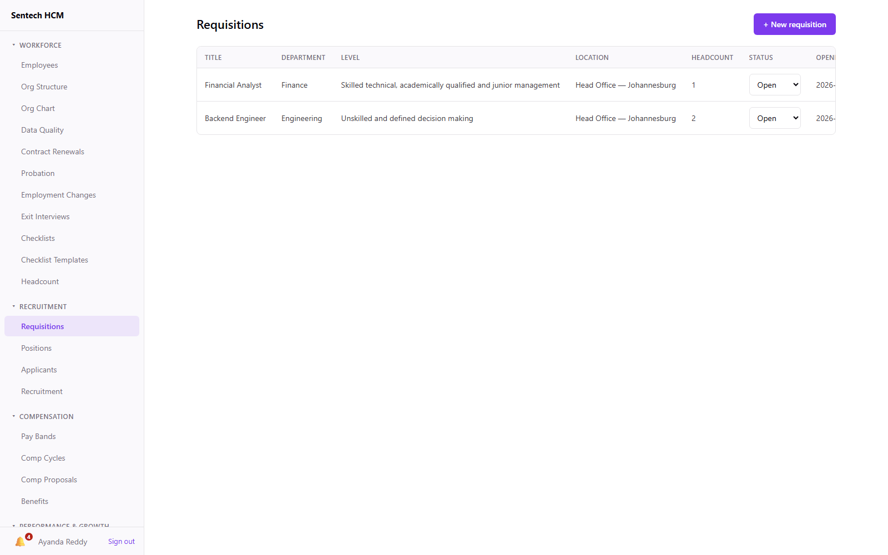

Fill in the title, department, occupational level, job grade, location and headcount, then click
**Create requisition**.

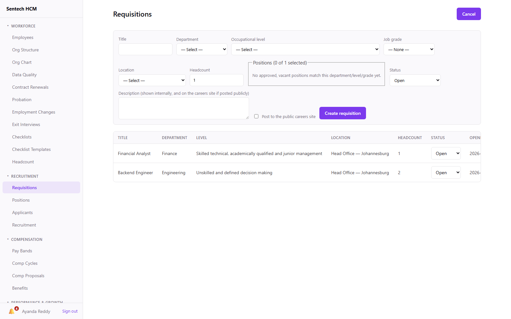

**What this means:** the **Positions** box shows which already-approved, vacant posts match what you've
typed — a requisition should normally tie back to a real approved post, not exist on its own. Tick
**Post to the public careers site** if this vacancy should be visible to the public.

### Step 2 — Track applicants

Click **Applicants** to see everyone who has applied, across every open requisition, with their current
stage (Applied, Interview, Offer, Hired, Rejected).

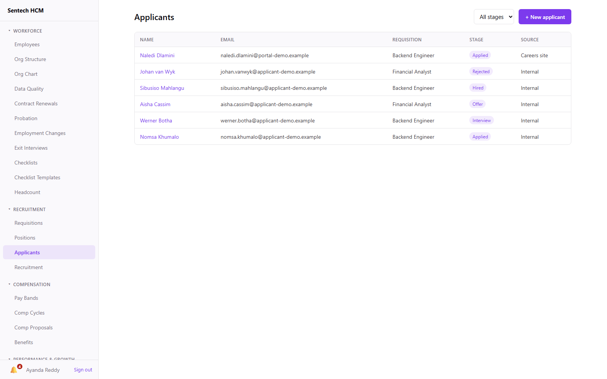

Click a name to open their full application.

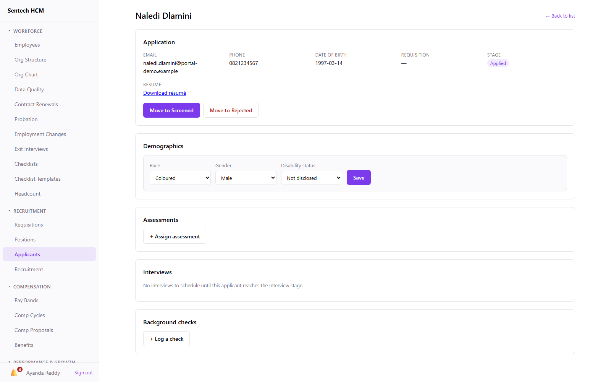

**What this means:**
- **Move to Screened** / **Move to Rejected** (the buttons change depending on the current stage) — this is
  how you advance someone through the pipeline. There's no "undo" button; if you move someone by mistake,
  ask your HR admin.
- **Download résumé** only appears if the applicant uploaded one, and only recruiters/HR admins can use it —
  the link is logged every time it's clicked.
- **Demographics** are only visible once the applicant has given consent — you can't fill this in on their
  behalf without it.
- Lower down: **Assessments**, **Interviews**, and **Background checks** sections, each with its own
  "+ Assign / + Log" button, appear as the applicant reaches the relevant stage.

---

## 5. Onboarding a new hire

Click **Checklists** (under **WORKFORCE**). An onboarding checklist is created **automatically** the moment
someone is hired — you don't create it yourself unless you're backfilling one for a template published
after the fact.

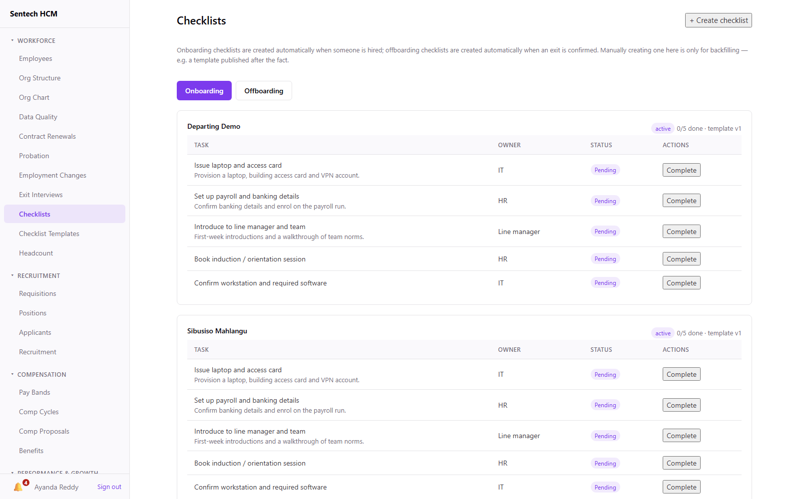

**What this means:** each card is one person's checklist, with a task list — who owns each task (IT, HR,
line manager) and its status. Click **Complete** on a task once it's done. The **Onboarding** / **Offboarding**
toggle switches between the two kinds of checklist; use **Checklist Templates** (just above it in the menu)
if you need to change what tasks a future checklist will contain.

---

## 6. Managing probation

Click **Probation**. This page tracks every employee's probation period from start to confirmation.

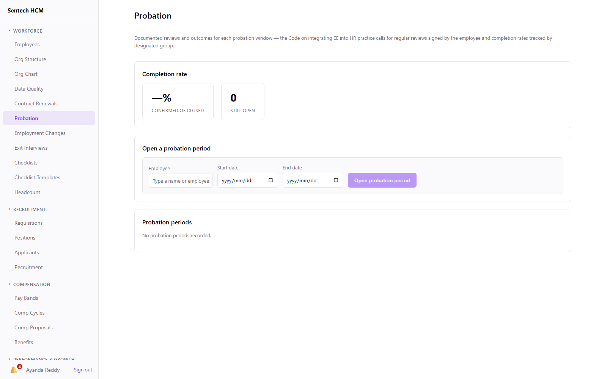

**To open a new probation period:** type the employee's name into the **Employee** box, pick a start and
end date, and click **Open probation period**.

**What this means:** once a period is open, it appears in the **Probation periods** list below the form,
where a manager records dated reviews against it (recommend continue / extend / confirm / terminate) and —
for the confirm/terminate outcome — the employee is asked to countersign electronically with their own
password. The **Completion rate** card at the top tracks how many probations closed as confirmed vs.
terminated across the organisation.

---

## 7. When someone leaves

Two related pages: **Employment Changes** (the formal exit record) and **Exit Interviews** (capturing why).
Both live under **WORKFORCE**.

Click **Employment Changes**, then **+ Propose change**.

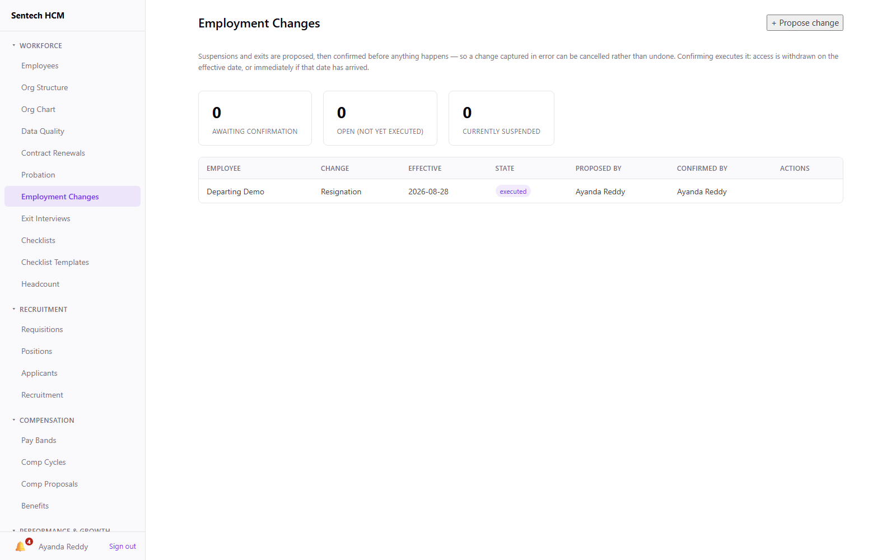

Pick the employee, the type of change (resignation, retirement, dismissal, suspension, etc.), an effective
date, and a reason, then click **Propose change**.

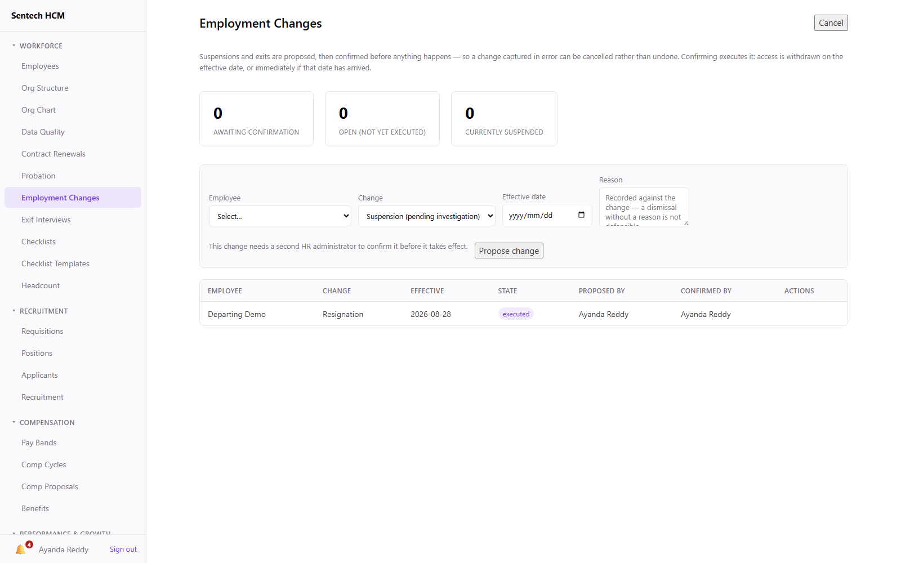

**What this means — read this carefully:** a proposed change does nothing by itself. **A second HR
administrator — not the person who proposed it — must open it and confirm it** before anything actually
happens (access is withdrawn on the effective date, or immediately if that date has already arrived). This
two-person rule exists so a change captured in error can be cancelled instead of undone after the fact. If
you're the only HR admin logged in, you'll need a colleague to confirm it.

Once an exit is confirmed, an **offboarding checklist** is created automatically (see §5), and you can
capture the departure conversation under **Exit Interviews**.

---

## 8. Contract renewals

Click **Contract Renewals**. This page lists every fixed-term employee whose contract is approaching its end
date, ranked by how many days are left.

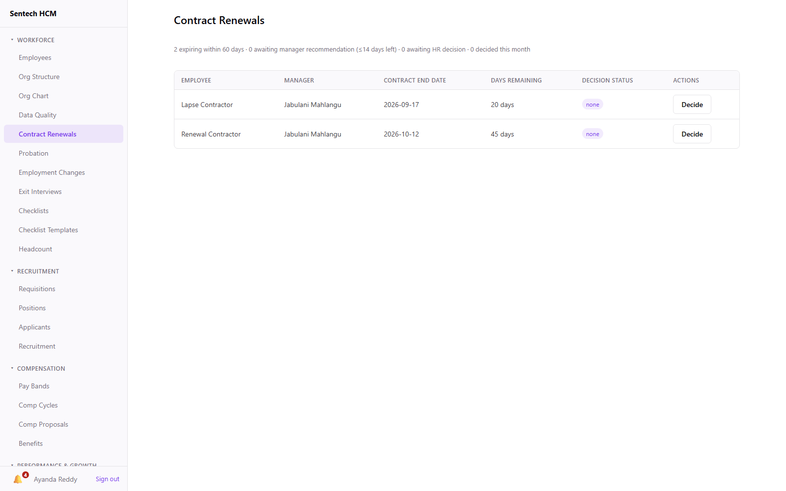

**What this means:** the summary line at the top ("2 expiring within 60 days · 0 awaiting manager
recommendation...") tells you at a glance whether anything needs attention. Click **Decide** on a row to
renew the contract, convert it to permanent, or let it lapse. A line manager records a **recommendation**
first; an HR admin makes the final **decision** — the two steps are deliberately separate, the same
two-person spirit as employment changes above.

---

## 9. Performance periods

Click **Performance Periods** (under **PERFORMANCE & GROWTH**). A performance period is one financial year
(1 April – 31 March), with scorecard templates and agreements underneath it.

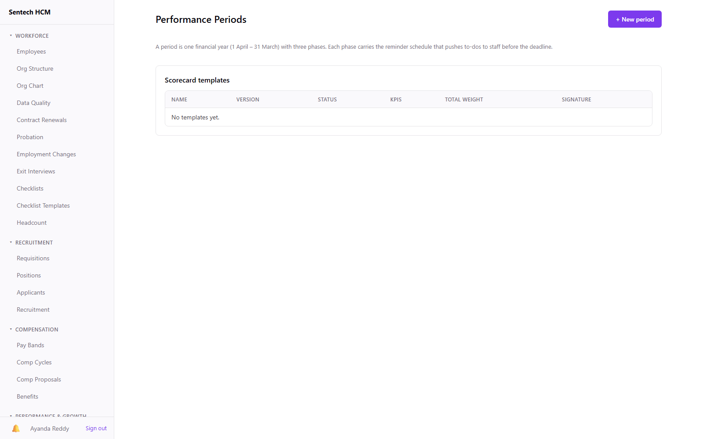

**What this means:** click **+ New period** to open a new financial year, or **+ New template** (once a
period exists) to define a scorecard shape — sections, KPIs and weightings — that agreements for that period
will be built from. Once agreements exist, staff and their managers work through them from **My
Performance** / **Team Performance** in the menu, not from this admin page.

---

## 10. Policies

Click **Policies** (under **PERFORMANCE & GROWTH**, visible to HR admins). This is the master list of every
company policy document — its version, status, and how many people have acknowledged it.

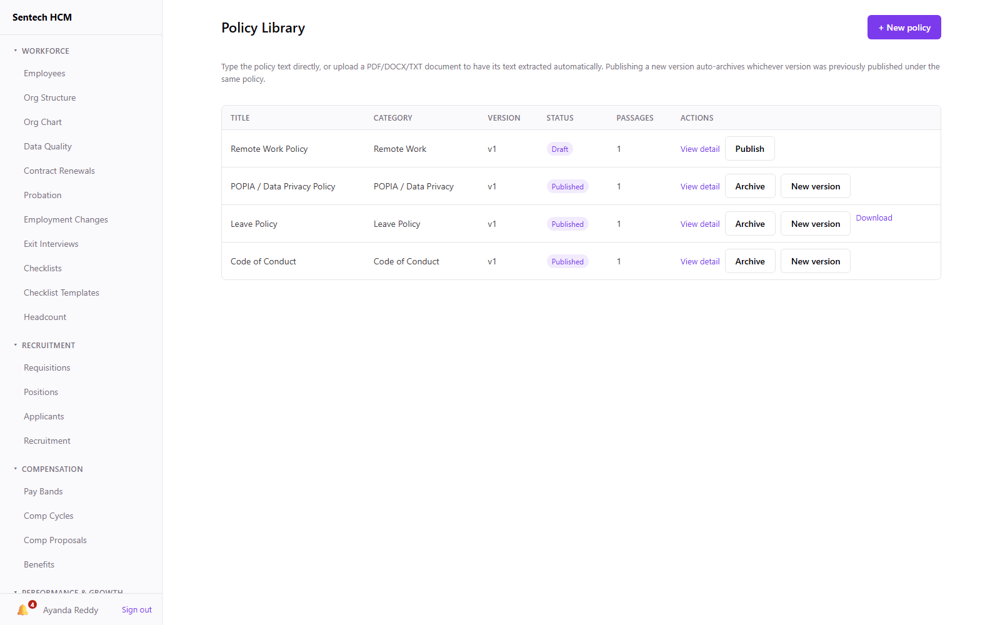

**To publish a new policy:** click **+ New policy**, either type the policy text directly or upload a
PDF/DOCX/TXT file (its text is extracted automatically), then click **Publish** on the row once you're ready
for staff to see it. Publishing a new version of an existing policy automatically archives whichever version
was published before it — there's no manual cleanup step.

**What this means:** a **Draft** policy is only visible here, not to staff. Once **Published**, it appears
for every employee under **My Policies**, and the **Policy Compliance Dashboard** (further down the menu)
tracks who has acknowledged it and who hasn't.

---

*This guide covers the tasks HR staff use most often. For anything not covered here — Employment Equity
reporting, compensation cycles, learning records, the audit log — ask your system administrator, or explore
the relevant section of the left-hand menu; every page follows the same list → detail → form pattern shown
above.*
